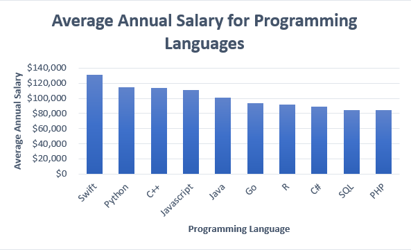

# Technology Industry Trends Analysis
## Overview of Analysis
Performed exploratory data analysis, statistical analysis, and data visualization on the Stack Overflow Developer Survey Dataset to identify current trends and possible future trends in the technology industry worldwide using Python, SQL, and IBM Cognos.
## Data Sources (provided by IBM Skills Network - Coursera)
* 2019 Stack Overflow Developer Survey – csv file formats
* 2019 Stack Overflow Developer Survey– SQLite file format
## Technologies Used
### Languages:
* Python
* SQL
### Python Modules:
* Pandas 
* MatPlotLib
* Seaborn
* SQLite3
* Openpyxl
### Tools/Softwares:
* Jupyter Notebook
* IBM Cognos
* Microsoft Excel
### Web Frameworks:
* Flask
## Methodology

* Performed exploratory/statistical analysis 
    * Preliminary exploratory data analysis was performed on csv  data using Python   

* Created Python visualizations 
    * SQLite file was read in using Pandas and DB-API connection
    * Pandas dataframes were used to perform exploratory data analysis and to create visualizations using Pandas, MatPlotLib, and Seaborn libraries.   

* Created an IBM Cognos Dashboard to visualize industry trends
    * csv data was imported into IBM Cognos to create Dashboard
    * IBM Cognos Dashboard was made to visualize current/future trends and demographics trends according to the Stack Overflow developer survey  

    
## Results of Analysis

[Link to presentation for technology industry trends analysis](technology_industry_trends_analysis.pdf) 

### IBM Cognos Dashboard Results

Dashboard Tab 1. 

 

Dashboard Tab 2. 

 

Dashboard Tab 3. 

  

### Examples of [Python Seaborn and Pandas Visualizations](data_visualization.ipynb) using SQLite data

Top 5 Languages Used in the Tech Industry: 

 

Top 5 Databases Used in the Tech Industry: 

 

Top 5 Databases that Respondents Want to Learn in the Next Year: 

 

Median Compensation for Employees in the Tech Industry (Aged 45 to 60) 

  

### Microsoft Excel Visualization from openpyxl imported data

 

 

